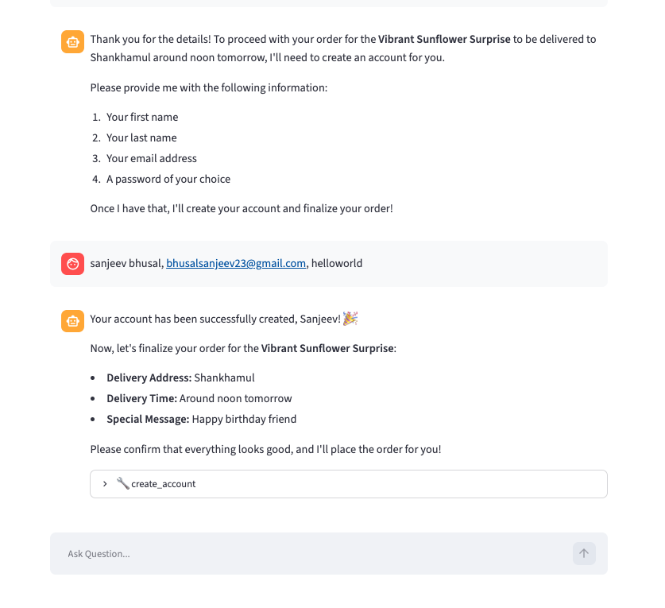

# Setup

1. Install dependencies.

```sh
uv sync
```

2.  Postgres setup

Start the database and open a `psql` session:

```sh
# Run postgres (pgvector image, exposed on host port 5434)
docker compose up

# Connect to postgres
psql -h localhost -p 5434 -U postgres -d vectordb
```

Then run the following **inside the psql prompt** to create the extension, tables,
and indexes:

```sql
-- Create pgvector extension
CREATE EXTENSION IF NOT EXISTS vector;

-- Create tables (VECTOR(1024) matches the embedding model's output dimension)
CREATE TABLE faqs (
    id SERIAL PRIMARY KEY,
    question TEXT NOT NULL,
    answer TEXT NOT NULL,
    embedding VECTOR(1024)
);

CREATE TABLE inventory (
    id TEXT PRIMARY KEY,
    name TEXT NOT NULL,
    quantity INTEGER NOT NULL,
    price NUMERIC NOT NULL,
    type TEXT NOT NULL,
    description TEXT NOT NULL,
    embedding VECTOR(1024)
);

CREATE TABLE users (
    id SERIAL PRIMARY KEY,
    first_name TEXT NOT NULL,
    last_name TEXT NOT NULL,
    email TEXT UNIQUE NOT NULL,
    password_hash TEXT NOT NULL
);

CREATE TABLE orders (
    id SERIAL PRIMARY KEY,
    user_id INTEGER NOT NULL REFERENCES users(id),
    product_id TEXT NOT NULL REFERENCES inventory(id),
    quantity INTEGER NOT NULL CHECK (quantity > 0),
    delivery_location TEXT NOT NULL,
    created_at TIMESTAMPTZ NOT NULL DEFAULT now()
);

-- Create indexes
CREATE INDEX faqs_embedding_idx
ON faqs
USING hnsw (embedding vector_cosine_ops);

CREATE INDEX inventory_embedding_idx
ON inventory
USING hnsw (embedding vector_cosine_ops);
```

Customers sign in through the app's sidebar, which validates their email and
password against the `users` table. There is no in-app sign-up, so seed at least
one user manually. Passwords are stored as salted PBKDF2 hashes, so generate the
hash with the app's helper (run from the project root, after `uv sync`):

```sh
uv run python -c "from tools import _hash_password; print(_hash_password('helloworld'))"
```

Then insert the user **inside the psql prompt**, pasting the hash you generated:

```sql
INSERT INTO users (first_name, last_name, email, password_hash)
VALUES ('Test', 'User', 'test@test.com', '<paste-hash-here>');
```

3.  Add environment variables

```sh
cp .env.example .env
```

Then edit `.env` and set `OPENAI_API_KEY`. The other variables are pre-filled and
should be kept:

- `EMBEDDINGS_MODEL` — **required**; the sentence-transformers model used to embed
  FAQs, inventory, and queries. It must produce 1024-dim vectors to match the
  `VECTOR(1024)` columns above.
- `HF_HUB_OFFLINE` / `TRANSFORMERS_OFFLINE` — set to `1` so the embedding model
  loads from the local cache without making network calls to Hugging Face.

> **Note:** `vector_store.py` loads the embedding model with `device="mps"`, which
> requires Apple Silicon. On other platforms, change `device` to `"cuda"` (NVIDIA
> GPU) or `"cpu"` in `vector_store.py`.

# Running the application

1. Load data to database. This step creates embeddings for faqs and inventory and stores the data to database. **This step should only be done once**. In `vector_store.py` file, uncomment the code under `if __name__ == "__main__"` and run

```sh
uv run vector_store.py
```

2. Run streamlit server.

```sh
uv run streamlit run server.py
```

# Testing

Tests live in `tests/` and cover the authentication design.

```sh
# Fast, deterministic tests (no LLM calls).
uv run pytest

# Include the slow end-to-end tests that drive the real agent
# (does real llm calls to gpt-4o-mini)
uv run pytest --run-slow
```

Tests use a self-contained fixture user and clean up after themselves, so they
do not depend on or modify your own seeded accounts.

# Authentication

The signed-in customer is bound to the Streamlit session, not supplied by the
model. Customers log in through the sidebar; `authenticate_user` validates their
credentials and stores the account in `st.session_state`. Tools that act on a
customer's behalf (`place_order`, `get_orders`, `get_current_user`) declare
`user_id` as a LangChain `InjectedToolArg`, so it is hidden from the model's tool
schema. The app's tool node injects the session user's id at call time and
refuses the call if no one is signed in. This closes the confused-deputy hole
where the model could otherwise pass an arbitrary or hallucinated `user_id`.

Because identity lives in `st.session_state`, a full browser refresh clears the
login. Persisting it across refreshes (e.g. a signed cookie) is a possible future
improvement.


