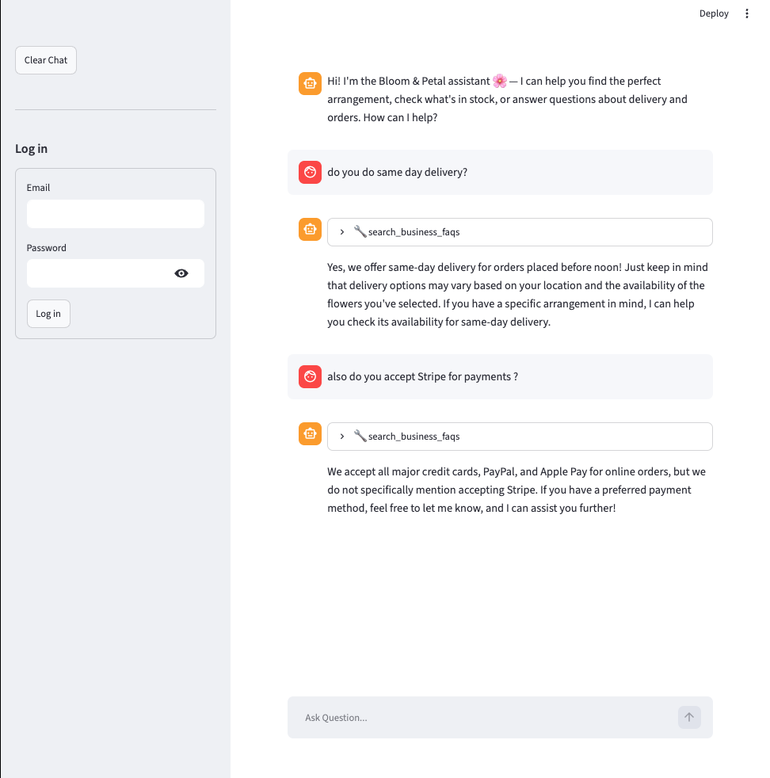
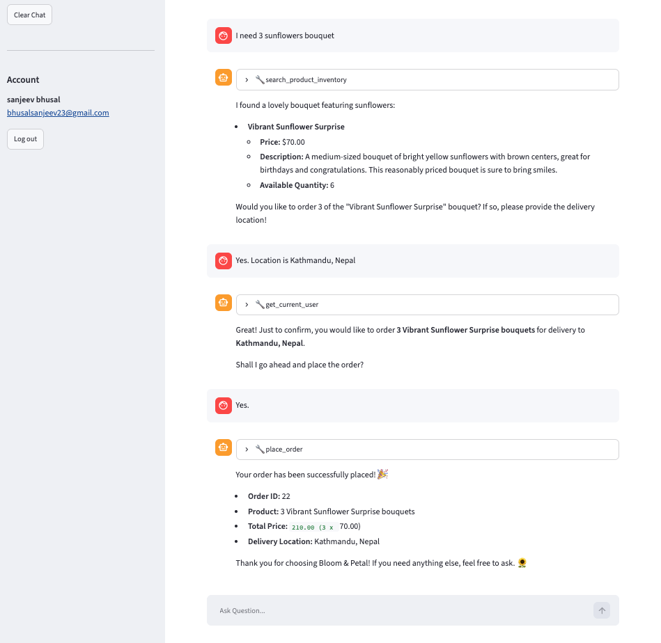
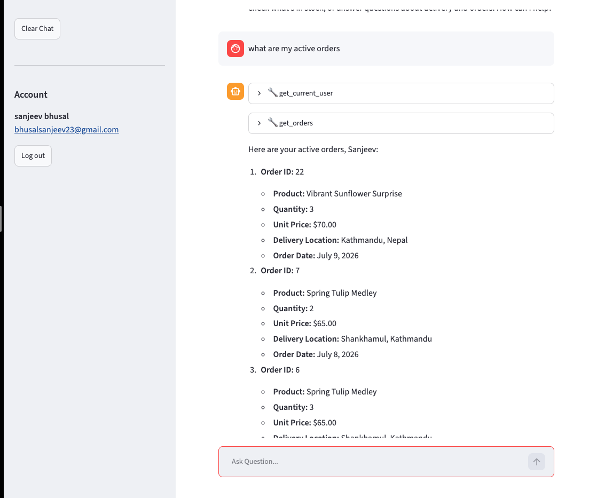
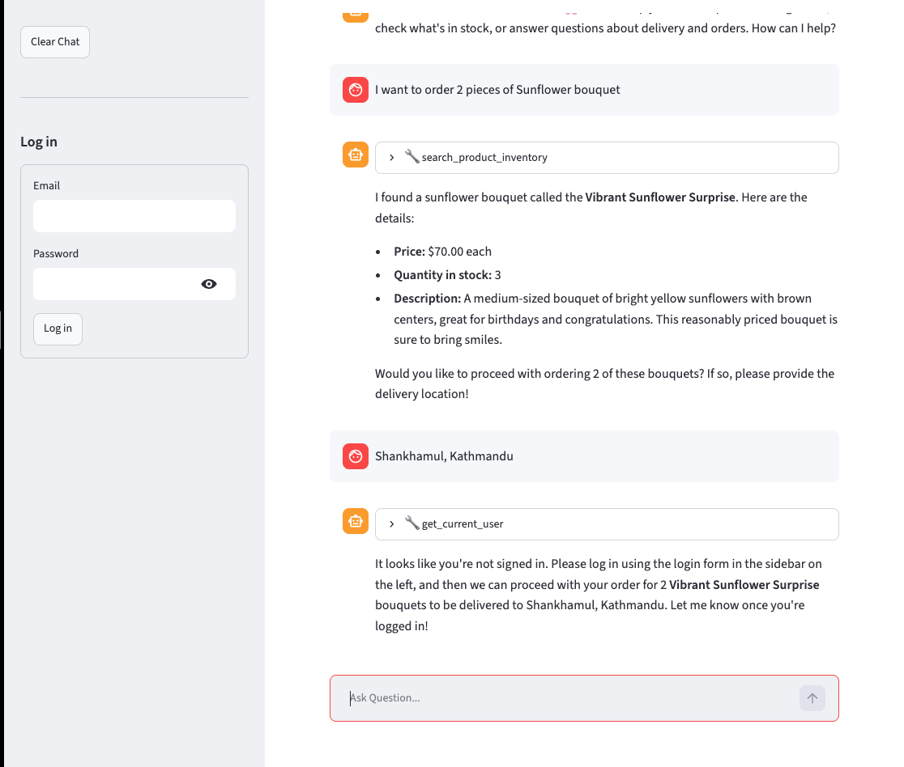

# Overview

Customer support chatbot for a flower shop that lets a visitor inquire about the business, products, inventory, orders etc. It has following functionalities:

### User can inquire about business information

Users can ask questions about business FAQ's. Eg: `do you do same day delivery?` or `do you accept Stripe for payments ?`.



### User can inquire about the products

Users can ask questions about available products, budgets, quantity etc. Eg: `I need tulips under 100$. do you have them ? I need 4 of them`.

### User can place an order

Users can order products directly. The chatbot asks followup questions such as `user's location`, `confirmation` etc. It knows the user it is talking to.



### User can view orders

Users can ask it to view their orders.



### It can redirect user to the right step

If a user isn't logged in and wants to order, it first asks user to log in.



# Developers Guide

## Setup

1. Install dependencies.

```sh
uv sync
```

2.  Postgres setup

Start the database and open a `psql` session:

```sh
# Run postgres (pgvector image, exposed on host port 5434)
docker compose up

# Connect to postgres
psql -h localhost -p 5434 -U postgres -d vectordb
```

Then run the following **inside the psql prompt** to create the extension, tables,
and indexes:

```sql
-- Create pgvector extension
CREATE EXTENSION IF NOT EXISTS vector;

-- Create tables (VECTOR(1024) matches the embedding model's output dimension)
CREATE TABLE faqs (
    id SERIAL PRIMARY KEY,
    question TEXT NOT NULL,
    answer TEXT NOT NULL,
    embedding VECTOR(1024)
);

CREATE TABLE inventory (
    id TEXT PRIMARY KEY,
    name TEXT NOT NULL,
    quantity INTEGER NOT NULL,
    price NUMERIC NOT NULL,
    type TEXT NOT NULL,
    description TEXT NOT NULL,
    embedding VECTOR(1024)
);

CREATE TABLE users (
    id SERIAL PRIMARY KEY,
    first_name TEXT NOT NULL,
    last_name TEXT NOT NULL,
    email TEXT UNIQUE NOT NULL,
    password_hash TEXT NOT NULL
);

CREATE TABLE orders (
    id SERIAL PRIMARY KEY,
    user_id INTEGER NOT NULL REFERENCES users(id),
    product_id TEXT NOT NULL REFERENCES inventory(id),
    quantity INTEGER NOT NULL CHECK (quantity > 0),
    delivery_location TEXT NOT NULL,
    created_at TIMESTAMPTZ NOT NULL DEFAULT now()
);

-- Create indexes
CREATE INDEX faqs_embedding_idx
ON faqs
USING hnsw (embedding vector_cosine_ops);

CREATE INDEX inventory_embedding_idx
ON inventory
USING hnsw (embedding vector_cosine_ops);
```

3. Authentication

Authentication isn't required to inquire about the business and products. But it is required to order items.

Customers sign in through the app's sidebar, which validates their email and
password against the `users` table. There is no in-app sign-up, so seed at least
one user manually. Passwords are stored as salted hashes, so generate the
hash with the app's helper (run from the project root, after `uv sync`):

```sh
uv run python -c "from auth import hash_password; print(hash_password('helloworld'))"
```

Then insert the user **inside the psql prompt**, pasting the hash you generated:

```sql
INSERT INTO users (first_name, last_name, email, password_hash)
VALUES ('Test', 'User', 'test@test.com', '<paste-hash-here>');
```

4.  Add environment variables

```sh
cp .env.example .env
```

Then edit `.env` and set `OPENAI_API_KEY` and `APP_SECRET_KEY`. The other
variables are pre-filled and should be kept:

- `EMBEDDINGS_MODEL`(**required**): the sentence-transformers model used to embed
  FAQs, inventory, and queries. It must produce 1024-dim vectors to match the
  `VECTOR(1024)` columns above.
- `APP_SECRET_KEY`(**required**): secret used to sign the login token so a session survives a refresh. Generate a random one with:
  ```sh
  uv run python -c "import secrets; print(secrets.token_hex(32))"
  ```
- `HF_HUB_OFFLINE` / `TRANSFORMERS_OFFLINE` — set to `1` so the embedding model
  loads from the local cache without making network calls to Hugging Face.

> **Note:** `vector_store.py` loads the embedding model with `device="mps"`, which
> requires Apple Silicon. On other platforms, change `device` to `"cuda"` (NVIDIA
> GPU) or `"cpu"`.

## Running the application

1. Load data to database. This step creates embeddings for faqs and inventory and stores the data to database. **This step should only be done once**. In `vector_store.py` file, uncomment the code under `if __name__ == "__main__"` and run

```sh
uv run vector_store.py
```

> **Note:** This step will take time since the model needs to be first downloaded from Hugging Face.

2. Run streamlit server.

```sh
uv run streamlit run server.py
```

> **Note:** The first time you interact with the chat, it will take some time to get response. This is because the model first needs to be loaded. The UI might show `load_model` text. Once the model is loaded, subsequent calls will be faster.

# Testing

Tests live in `tests/` and cover the application state, tool invoking and LLM calls

```sh
# Fast, deterministic tests (no LLM calls).
uv run pytest

# Include the slow end-to-end tests that drive the real agent
# (does real llm calls to gpt-4o-mini)
uv run pytest --run-slow
```

Tests use a self-contained fixture user and clean up after themselves, so they
do not depend on or modify your own seeded accounts.

# Authentication

Tools that act on a customer's behalf (`place_order`, `get_orders`, `get_current_user`) declare
`user_id` as a LangChain `InjectedToolArg`, so it is hidden from the model's tool
schema. The app's tool node injects the session user's id at call time and
refuses the call if no one is signed in.

The login survives a full browser refresh. On login, a token carrying
user id is stored in the browser's localStorage. On load the app loads
the user from the token.
